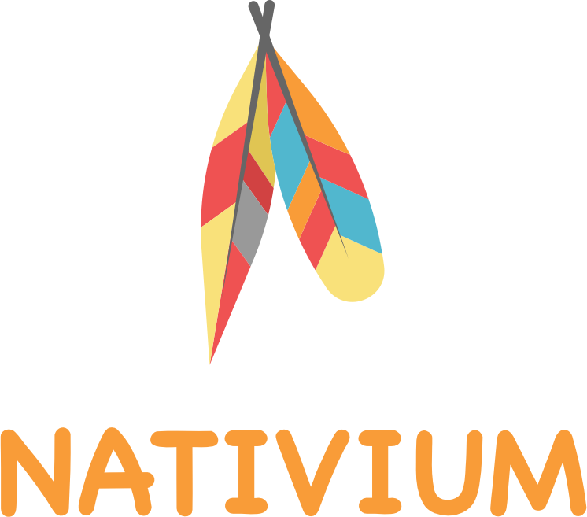
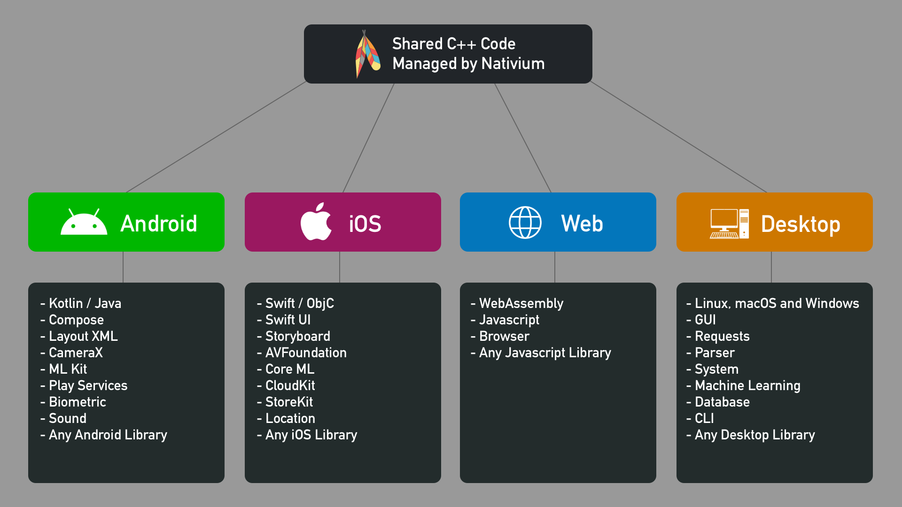

    
     
     
    C++ Multiplatform Modular Toolkit Template
     
    Nativium Philosophy: Write Once And Compile Anywhere
     

 

    
    
    
    
    
    
    

## About

Write a single code in C++ for the business logic with Nativium and compile for any platform.

You don't need rewrite your application because the generated binary can be attached to an existing application.

Supported platforms:

- Linux
- macOS
- Windows
- iOS
- tvOS
- watchOS
- macCatalyst
- WebAssembly (wasm)

Only need write platform-specific code where it’s necessary .For example, to implement a native user-interface or when working with platform-specific code, like get device battery level.

    

## How it work?

Nativium have two main concepts:

- **modules:** what code and dependencies need be compiled
- **targets:** how the code will be compiled (each platform is a target)

## What tools was used?

- **python:** to write all scripts (everything work from command line)
- **cmake:** to organize source code and projects to be compiled
- **conan:** to compile all C++ dependencies

## Template

This is a template repository that let you start easy and now your own project.

Think about your code instead of C++ project structure and organization, it is already done with Nativium.

Download this template and check sample apps to test and see it working on mobile, desktop and web.

Every command to setup, prepare, publish and generate final binary can be executed from command line and you can use any editor to work with Nativium.

Each piece of code is separated by modules, making easy extend with your custom code or any other C++ code and library.

## Documentation

You can read all about Nativium in the auto-generated documentation:

[https://nativium.s3.amazonaws.com/docs/index.html](https://nativium.s3.amazonaws.com/docs/index.html)

## Demo

The Android sample can be downloaded here:

[https://play.google.com/store/apps/details?id=com.nativium.sample](https://play.google.com/store/apps/details?id=com.nativium.sample)

The iOS (also watchOS and macOS) sample can be downloaded here:

[https://apps.apple.com/br/app/nativium-c-tasks/id1492446109](https://apps.apple.com/br/app/nativium-c-tasks/id1492446109)

## Buy me a coffee

## License

[MIT](http://opensource.org/licenses/MIT)

Copyright (c) 2021-2022, Paulo Coutinho
